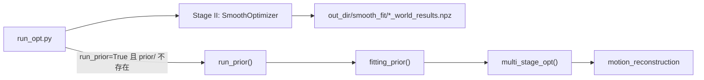

# run_prior / HMP 优化输入参数说明

Stage III 在 `run_opt.py` 中通过 `run_prior=True` 启用，调用 [`HMP/fitting.py`](../HMP/fitting.py) 中的 `run_prior()` → `fitting_prior()` → `multi_stage_opt()`，对 Stage II（`smooth_fit`）结果施加 HMP motion prior 并做窗口化优化。

## 调用链与触发条件



入口：[`dyn-hamr/run_opt.py`](../run_opt.py)（约 166–168 行）。

| 条件 | 说明 |
|------|------|
| `run_prior: True` | [`confs/config.yaml`](../confs/config.yaml) 默认为 `False` |
| 前置阶段 | 须先完成 `root_fit` 与 `smooth_fit`；`phases` 固定为 `['smooth_fit']` |
| 跳过逻辑 | 若 `out_dir/prior` 已存在则不再运行 |
| `clip_length` | 启用 prior 时 [`HMP/hmp_config.yaml`](../HMP/hmp_config.yaml) 中 `data.clip_length` 须为 **128**（与预训练 HMP 一致） |

## `run_prior` 函数形参

定义见 [`HMP/fitting.py`](../HMP/fitting.py) 中 `run_prior()`：

| 参数 | 来源 / 含义 |
|------|-------------|
| `cfg` | 完整 Hydra 配置（`paths`、`HMP`、`MANO` 等） |
| `dataset` | `MultiPeopleDataset`（`seq_name` 等） |
| `out_dir` | 优化输出目录（含 `smooth_fit/`） |
| `device` | CUDA / CPU |
| `phases` | 当前为 `['smooth_fit']`，读取 `{out_dir}/smooth_fit/*_world_results.npz` 最新 iter 的 `world` |
| `obs_data` | DataLoader 批次（与 Stage I/II 相同） |
| `hand_model` | 已实例化的 MANO |
| `opt` | 同 `cfg` |
| `data_args` | `cfg.data` |
| `prior_out` | 一般为 `{out_dir}/prior` |

## 核心数据：两路输入

### 1. `res_dict`（smooth_fit 的 world 结果）

由 [`optim/base_scene.py`](../optim/base_scene.py) 中 `get_optim_result()` 写入 `*_world_results.npz`。每条 track 使用：

| 字段 | 形状 | HMP 用途 |
|------|------|----------|
| `trans` | B × T × 3 | 平移初值与 target |
| `root_orient` | B × T × 3 | 根关节轴角 |
| `pose_body` | B × T × 45 | 15 个手部关节轴角（由 `latent_pose` 解码） |
| `betas` | B × 10 | MANO shape |
| `is_right` | B × T | 左右手 |
| `cam_R` | B × T × 3 × 3 | 相机旋转 |
| `cam_t` | B × T × 3 | 相机平移 |
| `intrins` | 4 | 前 2：`cam_f`，后 2：`cam_center` |

在 `multi_stage_opt()`（约 822–835 行）中组装为 `init_dict` 的 `trans`、`root_orient`、`poses`、`betas`、`cam_*`、`is_right`。

### 2. `obs_data`（dataset / DataLoader）

[`data/dataset.py`](../data/dataset.py) 中 `__getitem__` 提供；HMP 实际读取：

| `obs_data` 键 | 来源 | HMP 映射 |
|---------------|------|----------|
| **`joints2d`** | `{track_dir}/{frame}_keypoints.json`（ViTPose / OpenPose，经 `load_keypoints_with_interp`） | `keyp2d` → `joints2d` → `target['joints2d']` |
| **`vis_mask`** | track 可见帧 | 窗口 padding 与 loss 掩码 |
| **`is_right`** | HaMeR `{frame}_mano.json` | 与 `res_dict['is_right']` 一致性校验 |

Stage I/II 使用的 `init_body_pose`、`init_trans` 等 **不** 直接进入 HMP，仅依赖 `smooth_fit` 结果与上表字段。

## `joint_2d` 与 `joints2d`

- 代码中 **没有** `joint_2d` 键名。
- 观测侧统一为 **`joints2d`**（`obs_data`）；HMP 内部 init 字典为 **`keyp2d`**。
- 评估路径中的 `joints_2d`（`run_quantitative_evaluation`）仅用于有 GT 的定量评测，**不参与** `run_prior` 主流程。

### 是否必须提供 2D 关键点？

| 层面 | 结论 |
|------|------|
| 代码结构 | **必须** 存在 `obs_data['joints2d']`，否则 `multi_stage_opt` 组装 `init_dict` 时会 `KeyError`。 |
| 优化质量 | **强烈建议** 使用有效 2D 检测： |
| | 1. `get_stage2_res()` 要求 `keyp2d` 时间长度与 `poses`/`trans` 一致（T ≥ 2）。 |
| | 2. `hmp_config.yaml` 的 `stg1`/`stg2` 中 `lambda_reproj: 0.05`，通过 `joints2d_loss` 约束重投影。 |
| | 3. 部分 rot 相关置信来自 `joints2d[..., 2]`。 |
| | 4. 低于 `MIN_KEYP_CONF`（0.4）的检测在 dataset 中被置零。 |
| 全零 `joints2d` | 可运行，但 reproj 与 conf 加权项几乎无效，主要依赖 smooth_fit 3D 初值与 motion prior。 |

**格式**：`(T, J, 3)`，`J` 为 `OP_NUM_JOINTS`（21）；HMP loss 对前 **16** 个 MANO 关节使用 conf。

预处理须生成：`dynhamr/track_preds/<seq>/<tid>/{frame}_keypoints.json`。

## 配置与外部资源

| 项 | 说明 |
|----|------|
| `cfg.paths.base_dir` | 项目根；HMP 权重目录 `{base_dir}/_DATA/hmp_model` |
| `cfg.HMP.config` | 默认 `hmp_config.yaml`（`clip_length=128`，`overlap_len=16`，`stg1`–`stg3`） |
| `cfg.HMP.vid_path` | 帧目录（须含 `*.jpg` 或 `*.png`）；默认 `${data.root}/images/${data.seq}`，与 `confs/data/video_*.yaml` 的 `sources.images` 一致 |
| HMP 权重 | `mean/std-neutral-128-30fps.pt` 等，与 `clip_length`、`fps` 匹配 |
| MANO | 与 Stage I/II 相同 |
| 序列长度 | T ≥ 2；按 128 帧滑窗、`overlap_len=16` cosine 拼接 |

## 输出

| 路径 | 内容 |
|------|------|
| `prior/diagnostics/hand-{i}/window-*/final.npz` | 每手每窗优化结果 |
| `prior/{seq}_000000_world_results.npz` | 拼接后的 world 结果（更新 `root_orient`、`trans`、`pose_body` 等） |
| `prior/diagnostics/windows.json` | 窗口元数据 |

## 简要结论

| 问题 | 答案 |
|------|------|
| 需要哪些输入？ | **smooth_fit world npz** + **`obs_data`：`joints2d`、`vis_mask`、`is_right`** + **HMP 配置/权重** + **MANO** |
| 是否要 `joint_2d`？ | 无此命名；需要 **`joints2d`**（`_keypoints.json` 管线） |
| 能否不传 2D？ | 不能省略字段；全零可跑但不推荐 |

启用示例：

```bash
python run_opt.py data=video_vipe run_prior=True run_opt=True
```
